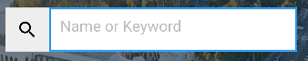
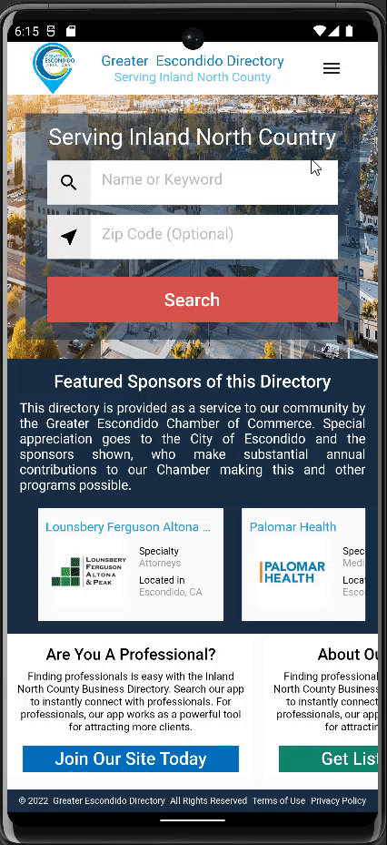

# greaterescondido

This app was created on the demand of client in which he wanted the first page of his website to be converted into the mobile version and everything else will be kept in the WebViews.

## Getting Started

In this project, Home page of the website https://directory.greaterescondido.org/ was developed just for the mobile Android and iOS.
Where NavBar of website was converted into App Drawer and the every link on the webiste was converted into seperate webview which were handled using Provider package.

I have learned in this project 
- App drawer
- WebView with back functionality 
- Container BackGround images
- Sticky footer
- Indexed Stack
- Sized ListView
- Image as Icon

## Custom Widget Created While Developement

Custom Text Field with Icon in front

## Project Output

